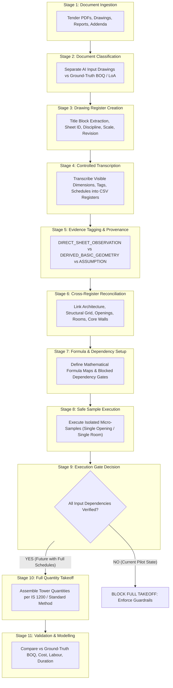

# Major Project System Architecture: Evidence-Grounded Construction Intelligence

**Platform**: Civil Engineering AI Agent for Autonomous Quantity Estimation & Takeoff Audit  
**Target Repository**: `10_Controlled_Transcription/`  
**Stage**: Priority G — System Architecture Synthesis  
**Status**: `SYSTEM_ARCHITECTURE_LOCKED`  

---

## 1. Executive Concept & Methodological Foundations

The primary failure mode of contemporary LLMs in civil engineering estimation is **unconstrained parametric hallucination**: when asked for a quantity or cost, AI models routinely generate plausible-looking numbers by multiplying generic averages (e.g., $150\text{ kg/m}^3$ steel or $23\%$ wall opening deductions) across approximate floor areas. In contract-level engineering, such ungrounded estimates fail audits and cause catastrophic commercial disputes.

This platform implements an **evidence-controlled multi-agent architecture** that enforces strict civil engineering guardrails:
- The system never outputs a calculated quantity unless every underlying dimension, boundary, and unit count is mathematically traceable to an approved drawing sheet.
- If an engineer-approved schedule is missing (e.g., Bar Bending Schedule, pile borehole depths, or tank wall thicknesses), the system **explicitly blocks execution** rather than guessing.

---

## 2. Eleven-Stage System Pipeline

---

## 3. Detailed Stage Functionality

### Stage 1: Document Ingestion
Ingests heterogeneous tender documentation: multi-page PDF drawing scans, Design Basis Reports, geotechnical borehole logs, technical specifications, and contract notices.

### Stage 2: Document Classification & Partitioning
Partitions documents into two fundamentally distinct ontological classes:
- **AI Input Documents**: Architectural plans, structural framing details, MEP layouts, and general specifications.
- **Ground-Truth Validation Documents**: Itemized tender BOQ, awarded contract prices, contractor's approved baseline schedule, and work completion certificates.

### Stage 3: Drawing Register Creation
Catalogs every sheet with exact title-block metadata: Sheet ID, discipline, exact title, scale, revision, revision date, and measurable content scope, filtering out non-relevant scope sheets.

### Stage 4: Controlled Discipline Transcription
Extracts only directly visible engineering evidence into tabular CSV registers without performing derivations:
- Substructure: piles, pile caps, tie beams
- Structural Frame: columns, shear walls, beams, slabs, stairs, water tanks
- Architecture & Finishes: room dimensions, door/window schedules, finish specifications

### Stage 5: Evidence Tagging & Provenance Control
Applies strict provenance tags to every record:
- `DIRECT_SHEET_OBSERVATION`: Printed directly on the drawing sheet.
- `DERIVED_BASIC_GEOMETRY`: Simple 2D geometric product ($W \times H$ or $L \times W$) computed from direct observations.
- `ARCHITECTURAL_SECTION_DERIVED`: Vertical heights extracted from architectural sections/elevations rather than structural sheets.
- `ASSUMPTION_REQUIRED`: Values not printed on drawing, requiring formal engineering assumptions.
- `MISSING`: Data absent from repository.

### Stage 6: Cross-Register Reconciliation
Resolves inter-discipline interfaces and clashes:
- Vertical storey height alignment between architectural sections and structural columns.
- Structural material classification (e.g., resolving lift core as RC shear wall, setting masonry to zero).
- Opening deduction mapping to specific host wall thicknesses.
- Spatial-to-finish mapping connecting room perimeters to finishes.

### Stage 7: Formula Setup & Input Dependency Mapping
Defines deterministic formula templates without executing them. Maps every required input parameter to its source drawing and establishes blocking gates where evidence is incomplete.

### Stage 8: Safe Sample Execution (Proof of Method)
Executes isolated micro-samples where all prerequisite inputs are directly observed (e.g., single opening area or single room floor area), generating complete, row-by-row auditable calculation steps.

### Stage 9: Takeoff Gate Decision (Guardrail Enforcement)
Evaluates the dependency register. If any prerequisite input is unverified (such as missing BBS or unsegregated wall centerlines), the system **strictly blocks full takeoff**.

### Stage 10: Full Quantity Takeoff (Post-Unblocking)
Once approved schedules are supplied, executes full-tower takeoff conforming to standard measurement methods (IS 1200).

### Stage 11: Validation & Cost/Duration Modelling
Compares system-generated quantities against ground-truth BOQ items. Models costs and duration only when verified pricing schedules and productivity benchmarks exist.

---

## 4. Ontological Classification: Inputs vs Ground Truth vs Derivations

| Category | Definition | Role in Platform | Current Pilot Status |
| :--- | :--- | :--- | :--- |
| **AI Input Documents** | Approved tender drawings, architectural plans, structural schedules, technical specifications. | Primary evidence ingested by the AI agent to extract dimensions, member marks, and materials. | **55 sheets ingested and transcribed into 10 controlled registers.** |
| **Ground-Truth Validation Documents** | Itemized priced/unpriced BOQ, contractor's work programme, LoA financial figures. | Benchmark data used to measure system takeoff accuracy; **never fed as AI generation prompt**. | **Missing at single-tower level.** Cost and BOQ validation are strictly blocked. |
| **Direct Observations** | Values visibly printed on drawing sheets (e.g., $C1\text{ }1200 \times 350\text{ mm}$, $W1\text{ }1200 \times 1200\text{ mm}$). | High-integrity evidence baseline; safe for deterministic reference. | **Fully transcribed across 11 CSV registers.** |
| **Derived Geometry** | Mathematical products of direct observations ($W \times H$, $L \times W$, $2(L+W)$). | Computed basic geometry; isolated to single-unit scopes. | **Verified across 18 sample calculations.** |
| **Architectural Section Derivations** | Vertical dimensions derived from elevation/section cuts rather than structural schedules. | Used for spatial reconciliation; blocked from structural steel cut-length derivations. | **Storey height ($3050\text{ mm}$) formally tagged as section-derived.** |
| **Assumption-Required Fields** | Engineering parameters missing from drawings (e.g., pile depth, OHT wall thickness). | Parameters requiring formal engineering assumptions; confidence capped at `ESTIMATED`. | **Zero active `HIGH_CONFIDENCE` assumptions allowed.** |
| **Blocked Evidence** | Critical schedules absent from drawings (BBS, wall centerlines, opening counts). | Triggers hard execution stops, preventing hallucinated takeoff. | **13 major trades strictly blocked.** |

