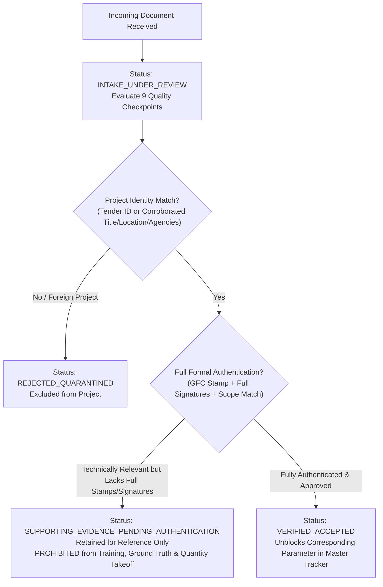

# Evidence Intake & Verification Protocol
**System:** Duliajan BQ Residential Tower Estimation-Readiness Pilot  
**Governance Standard:** Zero-Contamination & Mandatory Evidence Cross-Verification  
**Package Version:** `v2_verified_release`  
**Governing Directory:** `12_Evidence_Recovery_Package/`

---

## 1. Purpose & Mandate

This protocol establishes a mandatory, step-by-step verification process for every technical, structural, architectural, or commercial document received in response to the Evidence Recovery Requests (`REQ-V2-001` through `REQ-V2-008`).

> [!CAUTION]
> **Core Operating Rule:**
> No newly received document shall be directly incorporated into estimation registers, quantity calculations, cost models, or machine learning pipelines upon receipt.
> 
> Every incoming file must undergo rigorous verification across the checkpoints below. Only documents formally certified as `VERIFIED_ACCEPTED` may unblock locked parameters. Documents categorized under `SUPPORTING_EVIDENCE_PENDING_AUTHENTICATION` are strictly prohibited from being used as ground truth, cost validation, labour validation, duration validation, or ML-training data.

---

## 2. Six Approved Lifecycle Intake Statuses

The protocol formally defines and supports six discrete lifecycle intake statuses:

1. **`PENDING_TRANSMISSION`**: The RFI has been authored and cataloged but not yet formally transmitted to the custodian or contractor.
2. **`TRANSMITTED_AWAITING_REPLY`**: The formal request has been issued through project channels; awaiting receipt of documentation.
3. **`INTAKE_UNDER_REVIEW`**: The document has arrived and is undergoing verification against the 9 quality checkpoints.
4. **`SUPPORTING_EVIDENCE_PENDING_AUTHENTICATION`**: The document is technically useful and relevant to the Duliajan BQ tower, but lacks one or more formal authentication criteria (e.g., printed tender reference, official Good-for-Construction / GFC stamp, or complete engineering signature trail).
   - **Operational Governance & Restrictions:**
     - It may remain cataloged in the repository as supporting technical reference material.
     - It **cannot** overwrite any approved project drawing.
     - It **cannot** unblock a validated material quantity.
     - It **cannot** be used as material ground truth, cost validation, labour validation, duration validation, or ML-training data.
5. **`VERIFIED_ACCEPTED`**: The document has successfully passed **all** mandatory project identity, scope boundary, source-authority, revision, and approval checkpoints. It is authorized to unblock the corresponding parameter in the estimation register.
6. **`REJECTED_QUARANTINED`**: The document conflicts with confirmed project identity, belongs to another project or historical tender (e.g., `NIT_CPI4685P21`), is demonstrably superseded by an approved release, or cannot be linked to Duliajan after reasonable cross-verification.

---

## 3. Mandatory Verification Checkpoints & Policies



### Checkpoint 1: Project Identity & Tender Reference Policy
- **Flexible Identity Corroboration:** A document shall **not** be rejected solely because it does not explicitly print the string `RITES/NERPO/OIL/BQ-HOUSING/25` or CPP ID `2025_RITES_246752_1`.
- **Permitted Corroboration Criteria:** Project identity may be established through a documented, verifiable combination of:
  1. Project Title: *"Construction of Workman Housing Complex (BQ Area)..."*
  2. Institutional Identity: Oil India Limited (OIL) as Client and RITES Limited as Executing Agency.
  3. Site Location: Duliajan, Dibrugarh District, Assam (Seismic Zone V).
  4. Drawing / Document Number series matching tender sequences (e.g., `RITES/BLD/AR/TD/...` or `STR/TD/...`).
  5. Document Author / Consultant / Contractor: M/s Badri Rai & Company or approved design consultants.
  6. Issue Date and Revision compatible with the 2025 EPC project timeline.
  7. Architectural/structural scope specifically matching the Typical Stilt+6 BQ residential tower.
  8. Explicit cross-reference from an already authenticated project document.
- **Strict Prohibition:** Any document belonging to the historical 2020 tender package (`NIT_CPI4685P21`) or other non-Duliajan operational fields remains strictly barred and must be marked `REJECTED_QUARANTINED`.

### Checkpoint 2: Client & Agency Institutional Identity
The document must bear official insignia, letterheads, or title blocks confirming Oil India Limited (OIL), RITES Limited (Tender Cell-NERPO Guwahati), and/or EPC Contractor M/s Badri Rai & Company.

### Checkpoint 3: Geographic Site Location
The document must specifically apply to Duliajan, Assam.

### Checkpoint 4: Drawing Revision & Issue Date Audit
Every drawing or schedule must have an identifiable revision index (e.g., Rev 0, Rev 1) and release date. To attain `VERIFIED_ACCEPTED`, it must carry an official **"Good for Construction" (GFC)** or **"Approved for Construction"** issuance stamp.

### Checkpoint 5: Scope Match to the Single Typical Stilt+6 BQ Tower
The document must specifically apply to the **Single Typical Stilt+6 Residential Workmen Housing Tower (Block A–H Typical)** with 24 units and $3,419.38\text{ sq.m}$ plinth area. Non-residential campus buildings (Guest House, Community Centre, Substation) must not be substituted.

### Checkpoint 6: Document Author & Approval Status
- The document must show the professional identification of the drafting, checking, and approving engineers.
- For `VERIFIED_ACCEPTED` status, contractor submittals must bear the signed approval stamp of the **RITES Engineer-in-Charge (EIC) / Resident Engineer**.
- Submissions lacking formal signatures but verified in scope are assigned `SUPPORTING_EVIDENCE_PENDING_AUTHENTICATION`.

### Checkpoint 7: Relation to Sheet STR/TD/100 and Sheet STR/TD/101
- Foundation submittals for piles must cross-reference the **207 bored pile layout on Sheet STR/TD/100**.
- Submittals for pile caps must resolve the **54 physical cap entities on Sheet STR/TD/101** and explicitly map all 91 piles supporting continuous strip caps.

### Checkpoint 8: Blocker Resolution Assessment
The review must explicitly document which RFI (`REQ-V2-001` through `REQ-V2-008`) and parameter IDs in `estimation_input_master_v2.csv` are addressed.

### Checkpoint 9: Supersession & Lineage Audit
The review must record whether the document supersedes, supplements, or amends an existing drawing sheet in the repository.

---

## 4. Intake Logging & Status Transition Workflow

Every document reviewed under this protocol must be logged in [`evidence_recovery_master_tracker.csv`](file:///home/shahnawaz/Documents/DataRequirement/OIL-RITES-Duliajan-BQ-Housing/12_Evidence_Recovery_Package/evidence_recovery_master_tracker.csv) and updated through its verified lifecycle status.

### Protocol Verification Sign-Off Template

```markdown
### Document Verification Sign-Off Log
- **Intake Log ID:** INTAKE-DUL-YYYYMMDD-###
- **Matching Request ID:** REQ-V2-00#
- **Document Title & File Name:** [File Name]
- **Document Source / Custodian:** [e.g., M/s Badri Rai & Co. Site Office]
- **Project Identity Corroboration:** PASS / FAIL [Document basis: Tender ID or combination of Title/OIL/RITES/Duliajan]
- **Scope Boundary Match:** PASS / FAIL [Single Typical Stilt+6 BQ Tower confirmed]
- **Authentication & Approvals:** PASS / PENDING / FAIL [GFC stamp, RITES EIC signature status]
- **Relation to Prior Drawings:** Replaces / Amends / References Sheet [STR/TD/### or AR/TD/###]
- **Blockers Addressed:** [List specific parameter IDs / RFIs]
- **Intake Status Assigned:** [VERIFIED_ACCEPTED / SUPPORTING_EVIDENCE_PENDING_AUTHENTICATION / REJECTED_QUARANTINED]
- **Operational Restrictions Applied:** [e.g., "None - parameter unlocked" OR "Retained for reference only; strictly prohibited from ground truth, quantity takeoff, cost, duration, and ML training"]
- **Verification Officer:** [Reviewer Name / Role]
- **Date Verified:** [YYYY-MM-DD]
```
