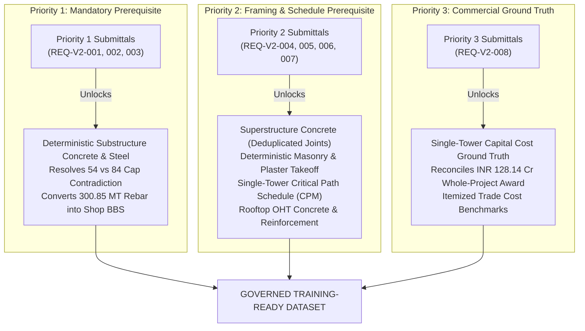

# Evidence Recovery & Readiness Dashboard: Duliajan BQ Housing
**Audited Entity:** Single Typical Stilt+6 BQ Residential Tower (Block A–H Typical)  
**Tender Reference:** `RITES/NERPO/OIL/BQ-HOUSING/25` | **CPP Tender ID:** `2025_RITES_246752_1`  
**Client:** Oil India Limited (OIL) | **PMC:** RITES Limited (Tender Cell-NERPO)  
**Awarded EPC Contractor:** M/s Badri Rai & Company (Award: ₹128.14 Crore excluding GST; 24 Months complex duration)  
**Dashboard Release:** `12_Evidence_Recovery_Package/`  
**Current State:** `GOVERNED_ENGINEERING_INPUT_BASELINE`

---

## 1. Executive Status & Governance Posture

```text
========================================================================================
CURRENT DATASET STATUS:              GOVERNED ENGINEERING-INPUT BASELINE
MACHINE LEARNING TRAINING STATUS:    BLOCKED
ITEM-WISE BOQ MATERIAL VALIDATION:   0.0%
COST ACCURACY ASSESSMENT:            NOT CALCULATED (0% item-wise priced BOQ coverage)
SINGLE-TOWER DURATION STATUS:        NOT CALCULATED (Contract 24 months is campus-wide)
LEGACY LABOUR ESTIMATE:              QUARANTINED (11,298 mandays preliminary ungrounded)
========================================================================================
```

> [!CAUTION]
> **Strict Operational Prohibition:**
> **Under NO circumstances shall any labour productivity model, single-tower duration schedule, unit-rate cost estimation, or supervised machine learning pipeline be executed until the corresponding missing evidence is formally received, verified, and registered under `12_Evidence_Recovery_Package/evidence_intake_and_verification_protocol.md`.**
> 
> Training models or generating schedules on unvalidated parametric assumptions introduces severe systemic error and violates project data governance standards.

---

## 2. Status of Evidence Requests & Unlocking Pathway

The recovery package organizes 8 critical engineering and commercial requests across three strict priority tiers:



### Comprehensive Request Matrix

| Request ID | Priority | Missing Document Description | Current Impact / Blocker | What Receiving It Will Unlock | Acceptance Sign-Off Criteria |
| :--- | :---: | :--- | :--- | :--- | :--- |
| **`REQ-V2-001`** | **Priority 1** | Approved Pile Schedule & Founding Levels | Pile depth assumed 18.0 m (midpoint of DBR 15–20 m); $\pm 2.5\text{ m}$ depth variance causes $\pm 146.3\text{ m}^3$ concrete variance. | Converts 207-pile substructure concrete ($1,053.49\text{ m}^3$) and rebar ($99.24\text{ MT}$) from estimated to deterministic engineering takeoff. | Signed schedule with individual coordinates, cut-off levels, socketing depth, and cage details. |
| **`REQ-V2-002`** | **Priority 1** | Approved Pile-Cap GA & Schedule | Unresolved contradiction: 54 physical layout entities on Sheet STR/TD/101 vs. 84 preliminary caps; 91 piles unallocated under strip caps; $23.38\text{ m}^3$ concrete variance. | Resolves foundation schedule contradiction; establishes exact cap dimensions ($L \times W \times D$) and complete 207-pile allocation map. | Signed GFC GA drawing showing numbered caps (PC-1 to PC-n, strip caps PC-W) and complete allocation map. |
| **`REQ-V2-003`** | **Priority 1** | Approved Contractor Bar Bending Schedules (BBS) | Zero shop BBS exists; all rebar ($300.85\text{ MT}$) relies on crude parametric intensities ($89.17$ to $140\text{ kg/m}^3$); bar bender labour cannot be calculated. | Converts $300.85\text{ MT}$ of estimated steel into verified fabricator cut lengths, hook details, and lap staggering conforming to IS 2502. | Approved fabricator cutting lists and BBS spreadsheets signed by RITES Engineer-in-Charge. |
| **`REQ-V2-004`** | **Priority 2** | Member-Wise Beam & Slab Framing Schedule | Gross beam centreline and averaged slab assumptions may materially distort framing quantities and floor-cycle modelling. The magnitude of this effect has not been calculated or independently validated. | Eliminates monolithic joint duplication; yields net member concrete volumes and accurate formwork contact surface areas. | Structural GA drawings with bay-by-bay clear spans, member sections, and panel-by-panel slab schedules. |
| **`REQ-V2-005`** | **Priority 2** | Room-Wise Architectural Finish Schedule & Centerlines | Masonry relies on gross perimeters and synthetic opening deduction ratios (ASM-007: 23%, ASM-008: 10%), inflating brickwork by up to 15–20%. | Replaces synthetic deduction percentages with exact CAD wall centerlines, column block-outs, and verified room finish takeoffs. | Dimensioned 1:50 architectural working drawings with wall centerlines, opening schedules, and finish schedule table. |
| **`REQ-V2-006`** | **Priority 2** | Approved Baseline Construction Programme (P6/MSP) | Single-tower duration is NOT CALCULATED. Contract 24 months is campus-wide; arithmetic pro-rata division is strictly prohibited. | Establishes binding single-tower critical path method (CPM) logic, floor pour cycle times, and resource loading curves. | Native Primavera P6 (`.xer`) or MS Project schedule file approved by RITES Engineer-in-Charge. |
| **`REQ-V2-007`** | **Priority 2** | Rooftop Overhead Water Tank (OHT) Detailing | Tank wall thickness not visible on Sheet STR/TD/109; quantities rely on generic code assumptions (ASM-010). | Replaces generic code assumptions with approved structural geometry and IS 3370 water-retaining reinforcement detailing. | Structural detail sheet showing plan, cross-sections, wall thicknesses, and tabulated bar schedule for OHT. |
| **`REQ-V2-008`** | **Priority 3** | Itemized EPC Cost Breakdown / Priced BOQ | Whole-project award of ₹128.14 Cr cannot validate single tower; 1/8 benchmark (₹16.0175 Cr) is strictly a rough proportional allocation. | Establishes single-tower capital cost ground truth; enables trade-by-trade cost validation against actual contract pricing. | Contractor approved price breakdown schedule or payment milestone break-up approved by OIL/RITES. |

---

## 3. Mandatory Evidence Intake & Acceptance Standard

Every incoming response to the RFIs must undergo formal intake verification according to [`12_Evidence_Recovery_Package/evidence_intake_and_verification_protocol.md`](file:///home/shahnawaz/Documents/DataRequirement/OIL-RITES-Duliajan-BQ-Housing/12_Evidence_Recovery_Package/evidence_intake_and_verification_protocol.md).

```text
Incoming Submission ──► 9 Quality Checkpoints ──► Status: VERIFIED_ACCEPTED (Unblocks Parameter)
                                              └──► Status: SUPPORTING_EVIDENCE_PENDING_AUTHENTICATION (Reference Only)
                                              └──► Status: REJECTED_QUARANTINED (Excluded)
```

### Nine Non-Negotiable Intake Checkpoints:
1. **Tender Reference & Identity Corroboration:** Cites `RITES/NERPO/OIL/BQ-HOUSING/25` or matches through a documented combination of Project Title, OIL/RITES entities, Duliajan site location, and tender drawing numbering.
2. **Client/Agency Identity:** Must bear official seals/headers of Oil India Limited (OIL), RITES Limited (Tender Cell-NERPO), or EPC Contractor M/s Badri Rai & Company.
3. **Location:** Must state Duliajan, Dibrugarh District, Assam (Seismic Zone V).
4. **Revision & Date:** Must be a Good-for-Construction (GFC) release with clear revision number and approval date.
5. **Scope Alignment:** Must specifically detail the typical Stilt+6 BQ residential tower (24 units, $3,419.38\text{ sq.m}$ plinth area).
6. **Signatures:** Must bear authorized engineering signatures and the RITES Engineer-in-Charge approval stamp.
7. **Traceability:** Must explicitly link to the 207-pile layout on Sheet STR/TD/100 or resolve the 54-cap layout on Sheet STR/TD/101.
8. **Blocker Alignment:** Must specifically resolve one or more documented parameters in `estimation_input_master_v2.csv`.
9. **Lineage:** Must document whether prior drawings are superseded or amended.

---

## 4. Package Artifact Index

All evidence recovery instruments are maintained in `12_Evidence_Recovery_Package/`:

1. [`evidence_recovery_master_tracker.csv`](file:///home/shahnawaz/Documents/DataRequirement/OIL-RITES-Duliajan-BQ-Housing/12_Evidence_Recovery_Package/evidence_recovery_master_tracker.csv)
   - Master ledger tracking all 8 recovery requests, authorities, acceptance criteria, intake status, and unlocked parameters.
2. [`priority_1_foundation_and_bbs_request.md`](file:///home/shahnawaz/Documents/DataRequirement/OIL-RITES-Duliajan-BQ-Housing/12_Evidence_Recovery_Package/priority_1_foundation_and_bbs_request.md)
   - Technical submission request covering pile schedules, founding levels, pile cap GA resolution (Sheet STR/TD/101), and structural BBS per IS 2502 / IS 13920.
3. [`priority_2_architecture_schedule_request.md`](file:///home/shahnawaz/Documents/DataRequirement/OIL-RITES-Duliajan-BQ-Housing/12_Evidence_Recovery_Package/priority_2_architecture_schedule_request.md)
   - Working drawing request covering dimensioned wall centerlines, finish schedules, beam/slab member schedules, OHT details, and the contractor CPM master programme.
4. [`priority_3_cost_request.md`](file:///home/shahnawaz/Documents/DataRequirement/OIL-RITES-Duliajan-BQ-Housing/12_Evidence_Recovery_Package/priority_3_cost_request.md)
   - Commercial request for the approved EPC Mode-II lump-sum price breakdown, milestone payment schedule, and tower-specific cost allocation.
5. [`evidence_intake_and_verification_protocol.md`](file:///home/shahnawaz/Documents/DataRequirement/OIL-RITES-Duliajan-BQ-Housing/12_Evidence_Recovery_Package/evidence_intake_and_verification_protocol.md)
   - Mandatory 9-point verification workflow governing document receipt, quality screening, and status transition.
6. [`evidence_recovery_readiness_dashboard.md` (This Document)](file:///home/shahnawaz/Documents/DataRequirement/OIL-RITES-Duliajan-BQ-Housing/12_Evidence_Recovery_Package/evidence_recovery_readiness_dashboard.md)
   - Executive dashboard and operational status summary.

